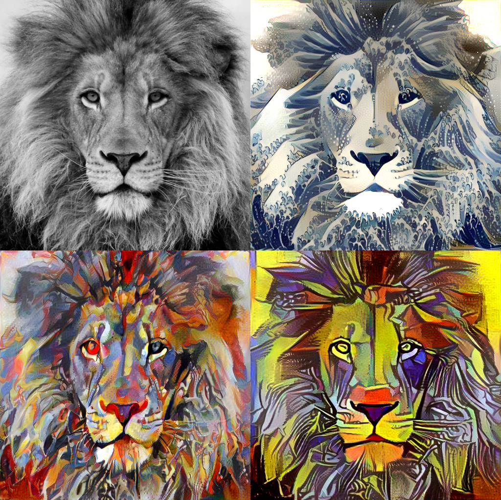

# Deep Learning for beginners

  
2016년 8월부터 딥러닝공부를 하면서 봤던 강의영상, 동영상, 블로그들의 목록입니다.

# What is Deep Learning ?

1. Deep Learning introduced by Nvidia (https://www.youtube.com/watch?v=C2FS9WVm7j4)

# Installation

1. Azure server NV series install (https://docs.microsoft.com/en-us/azure/virtual-machines/linux/n-series-driver-setup)

# Libraries

1. Tensorflow (https://www.tensorflow.org/)
2. Tensorflow Cookbook (https://github.com/nfmcclure/tensorflow_cookbook)
3. CNTK (https://github.com/Microsoft/CNTK, https://www.microsoft.com/en-us/research/product/cognitive-toolkit/)
4. CNTK Tutorial (https://notebooks.azure.com/library/cntkbeta2)
5. Keras Pretrained Models (https://github.com/fchollet/keras/blob/master/docs/templates/applications.md)
6. Keras Blog (https://blog.keras.io/index.html)
7. Python Torch tutorial (https://github.com/yunjey/pytorch-tutorial)
8. Incredible Pytorch (https://github.com/ritchieng/the-incredible-pytorch)
9. Caffe2 (https://caffe2.ai/)

# Machine Learning Basics

1. 딥러닝과 관련된 개념들 (https://www.youtube.com/playlist?list=PLjJh1vlSEYgvGod9wWiydumYl8hOXixNu)
2. Andrew NG 교수님의 Coursera 강의 (https://www.coursera.org/learn/machine-learning)
3. Ian goodfellow의 책 (https://github.com/HFTrader/DeepLearningBook)
4. Numpy-100 Tutorial (https://github.com/rougier/numpy-100)
5. Numpy tutorial (http://www.dataquest.io/blog/numpy-tutorial-python/?utm_source=mybridge&utm_medium=blog&utm_campaign=read_more)
6. Kaggle 1st place for 2 years (http://course.fast.ai/lessons/lesson1.html)
7. 아니 이 많은걸 언제 다 정리하셨대 (https://handong1587.github.io/index.html)

# General Neural Networks

1. 열한줄로 뉴럴넷 짜보기 (https://iamtrask.github.io/2015/07/12/basic-python-network/)
2. 한단계 한단계 Back propagation에 대한 친절한 설명 (https://mattmazur.com/2015/03/17/a-step-by-step-backpropagation-example/)
3. Batch Normalization (https://kratzert.github.io/2016/02/12/understanding-the-gradient-flow-through-the-batch-normalization-layer.html)
4. Gradient Descent Optimization Algorithm 비교 (http://sebastianruder.com/optimizing-gradient-descent/)

# Convolutional Neural Networks

1. CNN을 쉽게 이해하도록 도와준 영상 (https://youtu.be/FmpDIaiMIeA)
2. 그 유명한 cs231n 강의 (https://www.youtube.com/playlist?list=PLkt2uSq6rBVctENoVBg1TpCC7OQi31AlC)
3. 그 유명한 cs231n 강의노트 (http://cs231n.github.io/)
4. 한글로 설명이 잘되어있는 라온피플 블로그 (http://laonple.blog.me/220463627091) 
5. 시각화된 Convolution의 작동 (https://github.com/vdumoulin/conv_arithmetic)
6. 강의자 Andrej Kaparthy의 볼게 많은 블로그 (http://cs.stanford.edu/people/karpathy/)
7. 명화의 화풍을 따라 그리는 Neural Style (http://www.anishathalye.com/2015/12/19/an-ai-that-can-mimic-any-artist/, https://github.com/cysmith/neural-style-tf, https://www.youtube.com/watch?v=N14_w2RG1A8)
8. 레이어별로 뉴런의 Activation 및 반응을 볼 수 있는 자료 (https://github.com/yosinski/deep-visualization-toolbox)
9. Google Deepdream (https://github.com/google/deepdream)
10. 2016 No.1 ResNet (https://github.com/KaimingHe/deep-residual-networks)
11. Transposed Convoultion의 문제점과 해결방안 (http://distill.pub/2016/deconv-checkerboard/) 
12. 자료들이 모여있는 Awesome Deep vision (https://github.com/kjw0612/awesome-deep-vision)
13. ResNet in Tensorflow (https://github.com/ry/tensorflow-resnet)
14. ResNet, DenseNet (https://chatbotslife.com/resnets-highwaynets-and-densenets-oh-my-9bb15918ee32#.rbzbvof9l)
15. Spatial Transformer Network (https://github.com/fxia22/stn.pytorch)
16. Filtered image after convolution (http://setosa.io/ev/image-kernels/)
17. Convolution Transposed (https://arxiv.org/pdf/1603.07285.pdf)
18. LeNet to ResNet (http://slazebni.cs.illinois.edu/spring17/lec01_cnn_architectures.pdf)

# Detection & Semantic Segmentation

1. Fully Convolutional Network for Semantic Segmentation (https://github.com/shekkizh/FCN.tensorflow)
2. Faster R-CNN (https://github.com/rbgirshick/py-faster-rcnn)
3. Semantic Flow segmentation (https://ps.is.tuebingen.mpg.de/research_projects/semantic-optical-flow, https://ps.is.tuebingen.mpg.de/uploads_file/attachment/attachment/261/semanticflow.pdf)
4. Image Segmentation (http://warmspringwinds.github.io/tensorflow/tf-slim/2016/12/18/image-segmentation-with-tensorflow-using-cnns-and-conditional-random-fields/)
5. Localization & Detection gitbook (https://leonardoaraujosantos.gitbooks.io/artificial-inteligence/content/object_localization_and_detection.html)
6. Image Processing in classical ways(?)(https://www.giassa.net/?page_id=118) 
7. All about segmentation (https://github.com/mrgloom/Semantic-Segmentation-Evaluation)
8. Tensorflow Faster R-CNN (https://github.com/endernewton/tf-faster-rcnn)
9. Deeplab Resnet Tensorflow (https://github.com/DrSleep/tensorflow-deeplab-resnet)

# Unsupervised Learning

1.  Semi-supervised Learning (http://rinuboney.github.io/2016/01/19/ladder-network.html, https://github.com/CuriousAI/ladder)

# Autoencoder

1. 김범준씨의 Variational Autoencoder의 번역 (http://nolsigan.com/blog/what-is-variational-autoencoder/)
1. Generating Large Images from Latent Vectors (http://blog.otoro.net/2016/04/01/generating-large-images-from-latent-vectors/, https://arxiv.org/pdf/1512.09300.pdf)
2. Variational Autoencoder (https://www.youtube.com/watch?v=BiWRaES2WN0&t=991s, http://blog.fastforwardlabs.com/2016/08/12/introducing-variational-autoencoders-in-prose-and.html, https://github.com/kvfrans/variational-autoencoder)

# Generative Adversarial Networks

1. Adversarial Nets papers (https://github.com/zhangqianhui/AdversarialNetsPapers)
2. Generative Adversarial Networks by OpenAI (https://openai.com/blog/generative-models/)
3. 김태훈씨의 쉽게 설명한 DCGAN in Tensorflow (http://www.slideshare.net/carpedm20/pycon-korea-2016, https://github.com/carpedm20/DCGAN-tensorflow)
4. 간단한 GAN 설명과 동영상 예시 (http://keunwoochoi.blogspot.kr/)
5. 이미지의 빈부분을 채우는 GAN (http://bamos.github.io/2016/08/09/deep-completion/, https://github.com/bamos/dcgan-completion.tensorflow)
6. 텍스트를 이미지로 바꾸는 GAN text-to-image (https://github.com/reedscot/icml2016)
7. GAN video generation (http://web.mit.edu/vondrick/tinyvideo/)
8. DCGAN Tutorial (https://medium.com/@awjuliani/generative-adversarial-networks-explained-with-a-classic-spongebob-squarepants-episode-54deab2fce39#.gdxkk32d7)
9. InfoGAN Tutorial (https://medium.com/emergent-future/learning-interpretable-latent-representations-with-infogan-dd710852db46#.9iaqd4it5)
10. DiscoGAN in Pytorch (https://github.com/carpedm20/DiscoGAN-pytorch)
11. Wiseodd GANs (https://github.com/wiseodd/generative-models)
12. DiscoGAN official (https://github.com/SKTBrain/DiscoGAN)

# Recurrent Neural Networks

1. RNN에 대한 친절한 설명 (https://iamtrask.github.io/2015/11/15/anyone-can-code-lstm/)
2. Andrej Kaparthy RNN의 활용가능성 (http://karpathy.github.io/2015/05/21/rnn-effectiveness/)
3. Image caption generator in Tensorflow (https://github.com/tensorflow/models/tree/master/im2txt)
4. Awesome RNN (https://github.com/kjw0612/awesome-rnn)
5. Pytorch RNN (https://github.com/spro/practical-pytorch)

# NLP

1. CS224d for NLP (https://youtu.be/Qy0oEkCZkBI?list=PLlJy-eBtNFt4CSVWYqscHDdP58M3zFHIG)
2. Oxford Deep NLP (https://github.com/oxford-cs-deepnlp-2017/lectures)
3. Seq2seq TF1.0 code (https://github.com/ematvey/tensorflow-seq2seq-tutorials)
4. Denny Britz Seq2seq (https://github.com/google/seq2seq)
5. Pytorch for NLP tutorial (https://github.com/rguthrie3/DeepLearningForNLPInPytorch) 

## word2vec

1. Word2vec이 필요한 이유와 코드 공식사이트 번역본 (http://khanrc.tistory.com/entry/TensorFlow-6-word2vec-Theory, http://khanrc.tistory.com/entry/TensorFlow-7-word2vec-Implementation)
2. Chris Mccormick의 Word2vec 설명 (http://mccormickml.com/tutorials/)
3. 한국어와 NLTK, Gensim에 대한 박은정씨의 발표 (https://www.lucypark.kr/slides/2015-pyconkr/#1)
4. Genism tutorial (https://radimrehurek.com/gensim/models/word2vec.html)
5. Kaggle word2vec tutorial (https://www.kaggle.com/c/word2vec-nlp-tutorial/details/part-1-for-beginners-bag-of-words)
6. Word2vec의 역사(http://sebastianruder.com/word-embeddings-1/)

# Reinforcement Learning

1. Simple Reinforcement Learning with Tensorflow by Arthur Juliani (https://medium.com/emergent-future/simple-reinforcement-learning-with-tensorflow-part-0-q-learning-with-tables-and-neural-networks-d195264329d0#.hegtvglmg)
2. Udacity Self Driving Car Simulator (https://github.com/udacity/self-driving-car-sim)
3. UC Berkeley RL (http://rll.berkeley.edu/deeprlcourse/)
4. Denny Britz RL (http://www.wildml.com/2016/10/learning-reinforcement-learning/, https://github.com/dennybritz/reinforcement-learning)

# Visualization

1. t-SNE (https://www.analyticsvidhya.com/blog/2017/01/t-sne-implementation-r-python/, http://distill.pub/2016/misread-tsne/)
2. t-SNE 저자 설명 (https://www.youtube.com/watch?v=EMD106bB2vY)
3. MNIST 시각화 (http://colah.github.io/posts/2014-10-Visualizing-MNIST/)
4. Tensorboard 예시 (https://github.com/normanheckscher/mnist-tensorboard-embeddings)
5. How to use t-SNE effectively (http://distill.pub/2016/misread-tsne/)

# Data Augmentation

1. Data Augmentation with Keras api (http://machinelearningmastery.com/image-augmentation-deep-learning-keras/)
2. Winner of Galaxy zoo (http://benanne.github.io/2014/04/05/galaxy-zoo.html)
3. Elastic Deformation (https://gist.github.com/chsasank/4d8f68caf01f041a6453e67fb30f8f5a)
4. Elastic Deformation2 (https://www.kaggle.com/bguberfain/ultrasound-nerve-segmentation/elastic-transform-for-data-augmentation)
5. Image Data Augmentations (https://github.com/aleju/imgaug) 

# Blogs & Gist

1. Fast Forward Labs (http://blog.fastforwardlabs.com/)
2. Variational Autoencoder (http://oduerr.github.io/talks/)
3. Google Experiments (https://aiexperiments.withgoogle.com/)
4. Deep learning 2016 summary(https://tryolabs.com/blog/2016/12/06/major-advancements-deep-learning-2016/)
5. Brandon Amos Blog (https://bamos.github.io/)
6. Hvass_lab_tutorials (https://github.com/Hvass-Labs/TensorFlow-Tutorials)
7. Tensorflow Queue and Threads (https://blog.metaflow.fr/tensorflow-how-to-optimise-your-input-pipeline-with-queues-and-multi-threading-e7c3874157e0#.fbfqfygsm)
8. How to read images using tf.queue (https://gist.github.com/eerwitt/518b0c9564e500b4b50f)
9. Sungjoon choi's blog (http://enginius.tistory.com/)

# Awesome Series

1. Awesome2vec (https://github.com/MaxwellRebo/awesome-2vec)

# Mathematics for Deep Learning

1. Essence of Linear Algebra (https://www.youtube.com/playlist?list=PLZHQObOWTQDPD3MizzM2xVFitgF8hE_ab)
2. 공돌이의 수학정리노트 (https://wikidocs.net/book/563)
3. Brilliant.org (https://brilliant.org/)
4. Cross Entropy Loss & KL divergence (http://rdipietro.github.io/friendly-intro-to-cross-entropy-loss/)
